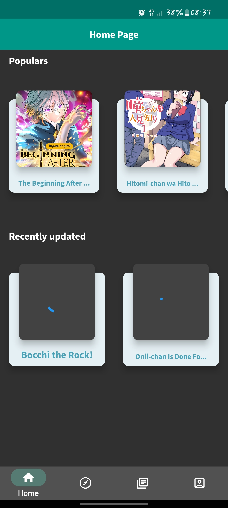
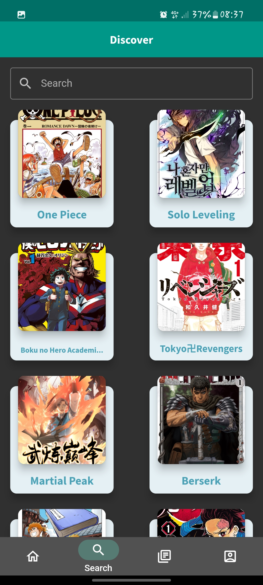
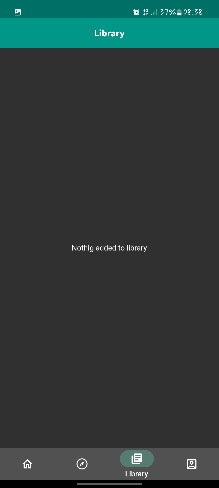
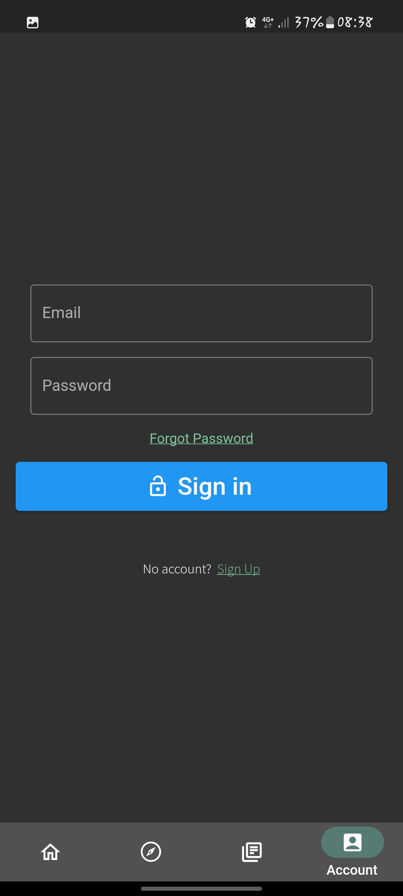

# manga_app

Applicazione per leggere manga

## Screenshot
#### Home page: 
#### Discover Page: 
#### Library Page: 
#### User Page: 

## Problemi Conoscuti 

- Il conteinar del manga non sempre si adatta alla dimensione dello schermo
- Se il manga non ha tanti capitoli, il primo capitolo rimane sotto ai pulsanti `resume` e `stato`

## Features mancanti

- User page migliore
- Home page migliore
- Possibilità di avere le cartelle nella libreria